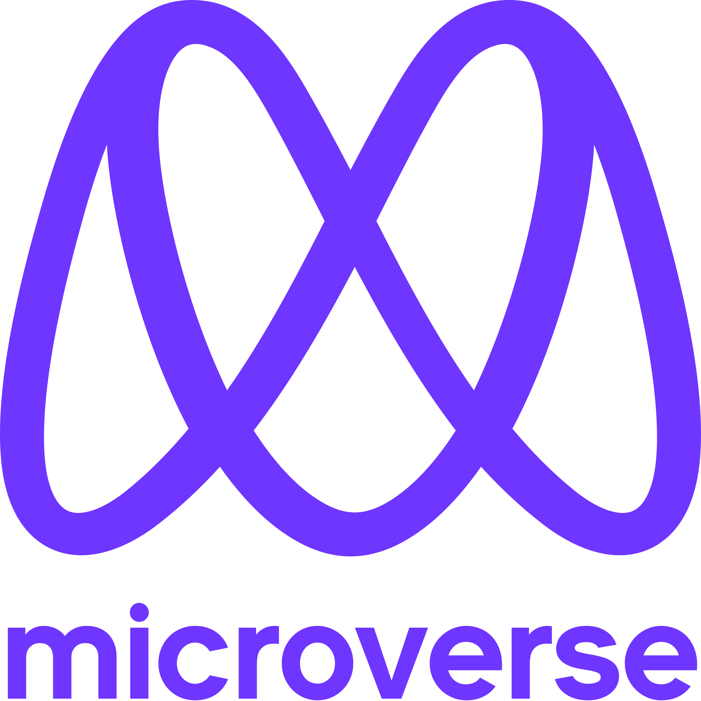

<a name="readme-top"></a>

<div align="center">

  
  <br/>

  <h3><b>Microverse Project</b></h3>


  <!-- Badges -->
<p>
  <a href="https://github.com/desorgui/festitech/graphs/contributors">
    
  </a>
  <a href="">
    
  </a>
  <a href="https://github.com/desorgui/festitech/network/members">
    
  </a>
  <a href="https://github.com/desorgui/festitech/stargazers">
    
  </a>
  <a href="https://github.com/desorgui/festitech/issues/">
    
  </a>
  <a href="https://github.com/desorgui/festitech/blob/main/MIT.md">
    
  </a>
</p>
   
<h4>
    <a href="https://desorgui.github.io/festitech">View Demo</a>
  <span> · </span>
    <a href="https://github.com/desorgui/festitech">Documentation</a>
  <span> · </span>
    <a href="https://github.com/desorgui/festitech/issues/">Report Bug</a>
  <span> · </span>
    <a href="https://github.com/desorgui/festitech/issues/">Request Feature</a>
  </h4>

</div>

<!-- TABLE OF CONTENTS -->

# 📗 Table of Contents

- [📖 About the Project](#about-project)
  - :camera: [Screenshots](#screenshots)
  - [🛠 Built With](#built-with)
    - [Tech Stack](#tech-stack)
    - [Key Features](#key-features)
  - [🚀 Live Demo](#live-demo)
- [💻 Getting Started](#getting-started)
  - [Setup](#setup)
  - [Prerequisites](#prerequisites)
  <!-- - [Install](#install) -->
  - [Usage](#usage)
  <!-- - [Run tests](#run-tests) -->
  <!-- - [Deployment](#triangular_flag_on_post-deployment) -->
- [👥 Authors](#authors)
<!-- - [🔭 Future Features](#future-features) -->
- [🤝 Contributing](#contributing)
- [⭐️ Show your support](#support)
- [🙏 Acknowledgements](#acknowledgements)
- [Presentation Video](#presentation-video)
<!-- - [❓ FAQ](#faq) -->
- [📝 License](#license)

<!-- PROJECT DESCRIPTION -->

# 📖 [Festitech] <a name="about-project"></a>

<!-- > Describe your project in 1 or 2 sentences. -->

**[Festitech]** This project was done as part of my curriculum at microverse, it was done at the end of my first module. in order to put into practice all the knowledge acquired in this module. this project is designed to display an event, and give information necessary for this event. I implemented it thinking about an annual technology festival that is done in my country. and I chose this topic to realize it.

## :camera: Screenshots <a name="screenshots"></a>

## 🛠 Built With <a name="built-with"></a>

### Tech Stack <a name="tech-stack"></a>

<!-- > Describe the tech stack and include only the relevant sections that apply to your project. -->

<details>
  <summary>Client</summary>
  <ul>
    <li><a href="https://html.com/">HTML</a></li>
    <li><a href="https://www.w3schools.com/css/">CSS</a>
  </ul>
</details>

<!-- <details>
  <summary>Server</summary>
  <ul>
    <li><a href="https://expressjs.com/">Express.js</a></li>
  </ul>
</details>

<details>
<summary>Database</summary>
  <ul>
    <li><a href="https://www.postgresql.org/">PostgreSQL</a></li>
  </ul>
</details> -->

<!-- Features -->

### Key Features <a name="key-features"></a>

<!-- > Describe between 1-3 key features of the application. -->

- **[Display Information About the event]**
- **[Display A list of speaker]**
- **[Display past Event]**
<!-- - **[key_feature_3]** -->

<p align="right">(<a href="#readme-top">back to top</a>)</p>

<!-- LIVE DEMO -->

## 🚀 Live Demo <a name="live-demo"></a>

- [Festitech Link](https://desorgui.github.io/festitech)

<p align="right">(<a href="#readme-top">back to top</a>)</p>

<!-- GETTING STARTED -->

## 💻 Getting Started <a name="getting-started"></a>

<!-- > Describe how a new developer could make use of your project. -->

To get a local copy up and running, follow these steps.

### Prerequisites

In order to run this project you need:

- Git
- Node JS
- A code Editor (VS Code, Sublime Text, ...)

<!--
Example command:

```sh
 gem install rails
```
 -->

### Setup

Clone this repository to your desired folder:

```
  cd my-folder
  git clone https://github.com/desorgui/festitech.git
  cd festitech
```

### Install

Install this project with: 

<!--
Example command: -->

```
 npm install
```

### Usage

To run the project, follow these steps:

- Open The folder in your file explorer then, right click on index.html and open with your browser.
<!--
Example command:

```sh
  rails server
```
--->

 ### Run tests

To run stylelint tests, run the following command: 

<!--
Example command: -->

  Run `npx stylelint "**/*.{css,scss}"`
<!-- 
### Deployment

You can deploy this project using: -->

<!--
Example:

```sh

```
 -->

<p align="right">(<a href="#readme-top">back to top</a>)</p>

<!-- AUTHORS -->

## 👥 Authors <a name="authors"></a>

<!-- > Mention all of the collaborators of this project. -->

👤 **Guishny DESOR**

- GitHub: [@desorgui](https://github.com/desorgui)
- Twitter: [@DGuishny](https://twitter.com/DGuishny)
- LinkedIn: [Guishny Desor](https://www.linkedin.com/in/desorguishny)

<!-- 👤 **Author2**

- GitHub: [@githubhandle](https://github.com/githubhandle)
- Twitter: [@twitterhandle](https://twitter.com/twitterhandle)
- LinkedIn: [LinkedIn](https://linkedin.com/in/linkedinhandle) -->

<p align="right">(<a href="#readme-top">back to top</a>)</p>

<!-- FUTURE FEATURES -->

<!-- ## 🔭 Future Features <a name="future-features"></a>

> Describe 1 - 3 features you will add to the project.

- [ ] **[new_feature_1]**
- [ ] **[new_feature_2]**
- [ ] **[new_feature_3]**

<p align="right">(<a href="#readme-top">back to top</a>)</p> -->

<!-- CONTRIBUTING -->

## 🤝 Contributing <a name="contributing"></a>

Contributions, issues, and feature requests are welcome!

Feel free to check the [issues page](../../issues/).

<p align="right">(<a href="#readme-top">back to top</a>)</p>

<!-- SUPPORT -->

## ⭐️ Show your support <a name="support"></a>

<!-- > Write a message to encourage readers to support your project -->

If you like this project please give it a ⭐️.

<p align="right">(<a href="#readme-top">back to top</a>)</p>

<!-- ACKNOWLEDGEMENTS -->

## 🙏 Acknowledgments <a name="acknowledgements"></a>

<!-- > Give credit to everyone who inspired your codebase. -->

- [https://www.behance.net/gallery/29845175/CC-Global-Summit-2015](https://www.behance.net/gallery/29845175/CC-Global-Summit-2015)

- Special Thanks to everyone who will get time to check this code and suggest any issues.


<p align="right">(<a href="#readme-top">back to top</a>)</p>

## Presentation Video <a name="presentation-video"></a>

- [https://www.loom.com/share/4ea18945f19749ef836f296553277cac](https://www.loom.com/share/4ea18945f19749ef836f296553277cac)


<p align="right">(<a href="#readme-top">back to top</a>)</p>

<!-- FAQ (optional) -->
<!-- 
## ❓ FAQ <a name="faq"></a>

> Add at least 2 questions new developers would ask when they decide to use your project.

- **[Question_1]**

  - [Answer_1]

- **[Question_2]**

  - [Answer_2]

<p align="right">(<a href="#readme-top">back to top</a>)</p> -->

<!-- LICENSE -->

## 📝 License <a name="license"></a>

This project is [MIT](./MIT.md) licensed.

<p align="right">(<a href="#readme-top">back to top</a>)</p>
